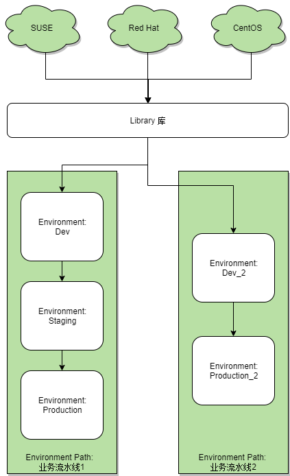

# Foreman Deployment

> 本章主要介绍如何快速的部署一个Foreman上手使用，适用于个人或者公司平时的补丁管理。
>
> 本文档为之前基于 2.3 版本所写，已不再更新此文档。

## Author

```
Name:Shinefire
Blog:https://github.com/shine-fire/Ops_Notes
E-mail:shine_fire@outlook.com
```

[TOC]

## Introduction

Foreman-katello  是一个All in one的开源项目，整合了很多其他开源模块用于实现服务器的集中管理，他从上游repo获取内容后，部署到各种平台上，可以支持虚拟化，物理机，公有云上的操作系统的统一管理。


## Enviroment Planning

### 版本说明

| Items           | Var   |      |
| --------------- | ----- | ---- |
| OS Version      | RHEL7 |      |
| Foreman Version | 2.3   |      |
|                 |       |      |

### 浏览器版本推荐：

- Google Chrome 54 or higher
- Microsoft Edge
- Microsoft Internet Explorer 10 or higher
- Mozilla Firefox 49 or higher

> 其他版本的浏览器未测试，不保证都能正常运行

### 防火墙

Protect your Foreman environment by blocking all unnecessary and unused ports.

| Port        | Protocol  | Required For                                                 |
| :---------- | :-------- | :----------------------------------------------------------- |
| 53          | TCP & UDP | DNS Server                                                   |
| 67, 68      | UDP       | DHCP Server                                                  |
| 69          | UDP       | TFTP Server                                                  |
| 80, 443     | TCP       | ***** HTTP & HTTPS access to Foreman web UI / provisioning templates - using Apache + Passenger |
| 3000        | TCP       | HTTP access to Foreman web UI / provisioning templates - using standalone WEBrick service |
| 5910 - 5930 | TCP       | Server VNC Consoles                                          |
| 5432        | TCP       | Separate PostgreSQL database                                 |
| 8140        | TCP       | ***** Puppet server                                          |
| 8443        | TCP       | Smart Proxy, open only to Foreman                            |

> Ports indicated with ***** are running by default on a Foreman all-in-one installation and should be open.

### YUM源

对于RHEL7，安装Foreman平台之前需要准备好以下YUM源：

- rhel-7-server-optional-rpms
- rhel-server-rhscl-7-rpms
- EPEL (Extra Packages for Enterprise Linux) 
- Foreman repositories（可以在官方选择需要的版本，安装相应rpm后会自动配置一个源 https://yum.theforeman.org/releases/）
- puppet repository（在官网安装一下这个软件包会自动配置yum源：https://yum.puppet.com/puppet6-release-el-7.noarch.rpm）


## 使用Foreman Installer部署

### 系统环境准备


#### 配置YUM源

##### 安装在线repos（适用于可以连通外网的环境）

下面这一段不管：
```bash
# yum install -y yum-plugin-fastestmirror
# yum -y localinstall https://yum.theforeman.org/releases/2.0/el7/x86_64/foreman-release.rpm
# yum -y localinstall https://fedorapeople.org/groups/katello/releases/yum/3.15/katello/el7/x86_64/katello-repos-latest.rpm
# yum -y localinstall https://yum.puppet.com/puppet6-release-el-7.noarch.rpm
# yum -y localinstall https://dl.fedoraproject.org/pub/epel/epel-release-latest-7.noarch.rpm
# yum -y install foreman-release-scl
```


```
curl -o /etc/yum.repos.d/CentOS-Base.repo https://mirrors.aliyun.com/repo/Centos-7.repo
yum -y install https://yum.puppet.com/puppet6-release-el-7.noarch.rpm
yum -y install http://dl.fedoraproject.org/pub/epel/epel-release-latest-7.noarch.rpm
yum -y install https://yum.theforeman.org/releases/2.0/el7/x86_64/foreman-release.rpm
yum -y install foreman-release-scl
```

##### 配置内网YUM源

根据内网实际情况配置（此处略过）


#### 检查加的repos

```bash
]# yum repolist
Loaded plugins: product-id, search-disabled-repos, subscription-manager

This system is not registered with an entitlement server. You can use subscription-manager to register.

repo id                      repo name                                   status
epel                         CentOS-7Server - EPEL                       13,594
foreman                      Foreman 2.3                                    730
puppet6                      Puppet 6 Repository el 7 - x86_64                8
rhel-7-server-optional-rpms  rhel-7-server-optional-rpms                  5,198
rhel-7-server-rpms           rhel-7-server-rpms                           5,652
rhel-server-rhscl-7-rpms     rhel-server-rhscl-7-rpms                     8,214
repolist: 33,396
```

#### 配置FQDN

```bash
# vim /etc/hosts
127.0.0.1   localhost localhost.localdomain localhost4 localhost4.localdomain4
::1         localhost localhost.localdomain localhost6 localhost6.localdomain6

192.168.31.111  tfm.example.com
```

#### 配置时间同步

```bash
# yum install -y chrony
# systemctl enable chronyd
# systemctl start chronyd
# timedatectl set-timezone Asia/Shanghai
```


### 3.2 使用foreman-installer进行安装

安装foreman-installer

```bash
 ~]# yum -y install foreman-installer
```

启动instller安装

```bash
# foreman-installer
Preparing installation Done
  Success!
  * Foreman is running at https://foreman-server.shinefire.com
      Initial credentials are admin / DYEHYBg3ufJt9CiP
  * Foreman Proxy is running at https://foreman-server.shinefire.com:8443
  The full log is at /var/log/foreman-installer/foreman.log
```

等待提示Success!安装成功，记录默认的admin**管理员密码**，例如上面的`DYEHYBg3ufJt9CiP`，可以在提示的路径中查看安装日志。

## WEB端登陆使用

浏览器中输入IP或者域名即可访问，


查看主界面


## Foreman-Kattlo资源管理框架

环境(Environment) 和发布路径（Environment Paths） :
所有从外部同步回来得资源会先放置与 Library 库中， 然后根据不同得生命周期需求，产生不同得发布路径， 如：Library   ->   开发  ->  测试 - >  生产环境

处于不同环境得client机器，可以选择从不同得environment中下载补丁包，实现生命周期管理需求， 如果为了简化，也可以统一直接从Library中拉取

完成这样定义后，所有软件包，需要经过一步步得发布流程，最终才能到生产环境中：



### Environment 

Create Environment Path

界面操作：[menu]-->[Content]-->[Lifecycle Enviroments]-->[Create Environment Path]

如下图：

【图】

Create Environment

界面操作：

【图】

### Content Views
因为library中的内容是持续不断再更新的（follow上游repo的发布频率），但是实际生产环境中的机器往往不需要经常更新，我们需要一个相对比较静态的library的“快照”，这样客户端只需要跟随content view来刷新，而不是上游一有变化立即随之升级，content view是一个集合，可以包含软件包，配置等
content view有版本。可以定期发布一个新的版本，同步Library中的更新

创建一个Content View步骤如下：
[Main] -> [Content] -> [Content View] -> [Create New View] 

【图】

在新创建的CV 添加yum content 后 Publish New Version
【图】add repository
【图】save

查看结果
【图】

后续可以定期发布新的CV版本 来实现内容版本管理。
【图】

### Content Promote

Content View 的新版本创立初期，都默认关联当前Library库中的内容（可以当作是Library在当时的快照）

Content View需要promote到不同的环境中以便关联不同类型的客户端，通常一个新的version release出来，优先promote给dev环境中使用， 一段时间后，发布新的2.0版本，则把1.0版本推到production中。dev环境使用较新版本。 依次发布，实现版本流水线控制


操作步骤如下:
[Main] -> [Content] -> [Content View] 
点击指定的content view进去选择指定的版本选择Actions-->Promote
【图】


## 客户端主机纳管

不同的linux服务器注册到foreman的时候，通过activation key来进行区分并绑定到不同的发布内容上， 再foreman中需要先创建好各个不同的activation key，并绑定到对应的资源，这样机器注册时指需要选择不同的activation key即可。 


## References

