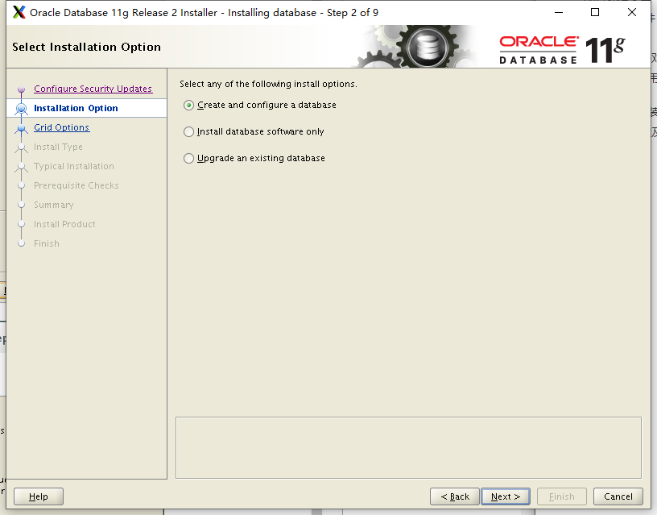
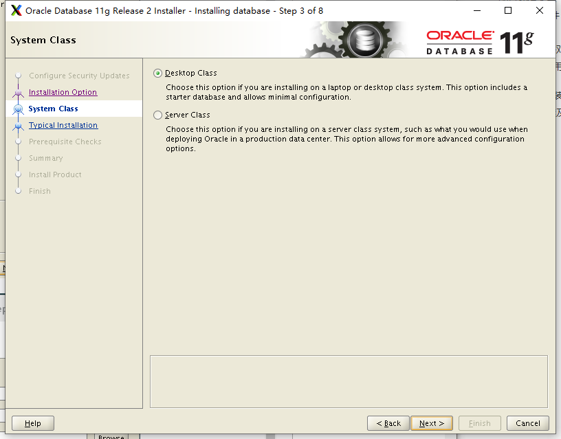
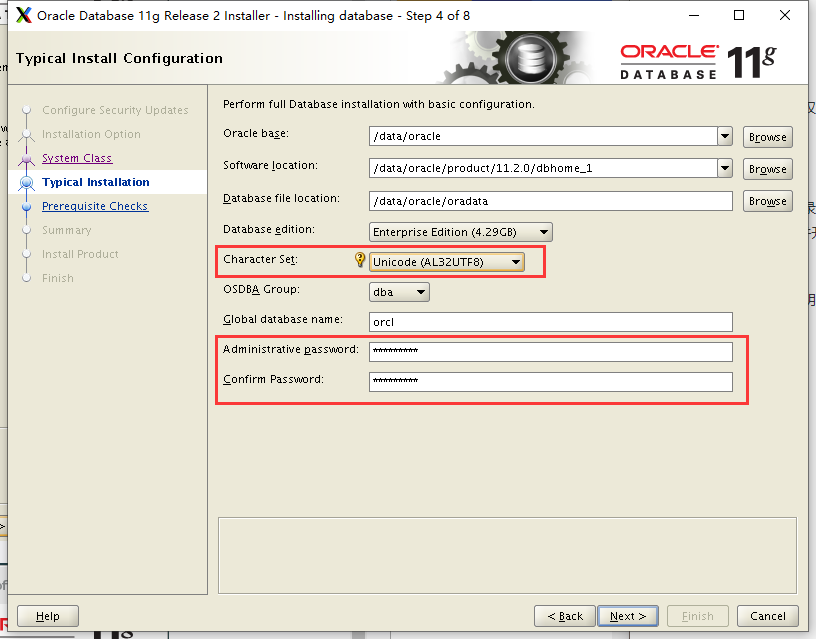
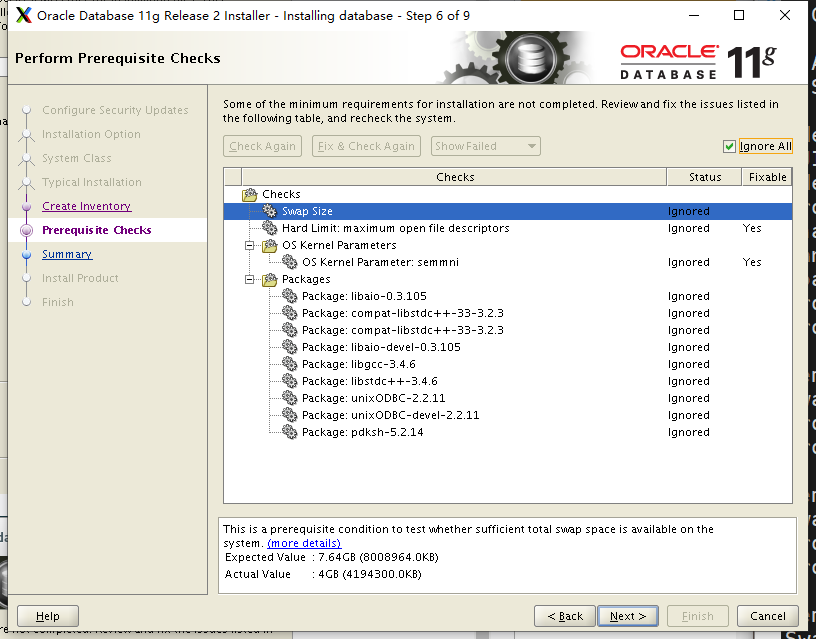
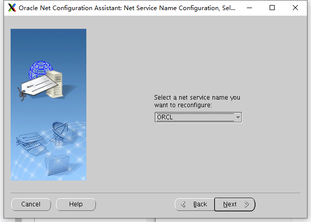
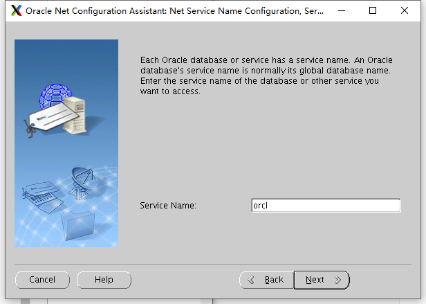
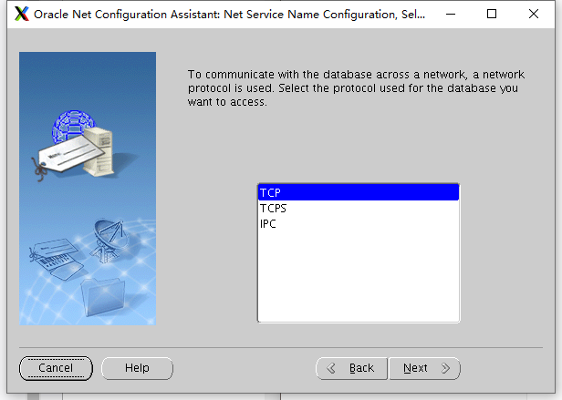
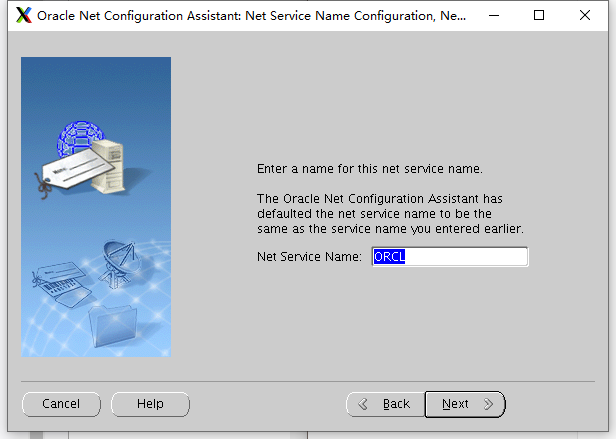
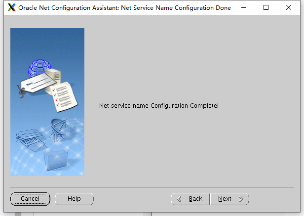

# Title

> 本章主要介绍如何对XXX进行一个快速的简单上手使用，适用于个人或者公司内部非常简易的传输文件使用。

## Author

```
Name:Shinefire
Blog:https://github.com/shine-fire/Ops_Notes
E-mail:shine_fire@outlook.com
```

## Introduction


## Steps

### 环境及系统要求

| item           | value       |
| -------------- | ----------- |
| os_version     | RHEL7.6     |
| oracle_version | Oracle11gR2 |
| memory         | 8G          |
| swap           | 4G          |
|                |             |
|                |             |
|                |             |

### 安装前的系统配置

#### 安装需要的软件包

```bash
# yum -y install binutils compat-libstdc++-33 compat-libstdc++-33.i686 elfutils-libelf elfutils-libelf-devel elfutils-libelf-devel-static gcc gcc-c++ glibc glibc.i686 glibc-common glibc-devel glibc-devel.i686 glibc-headers glibc-static ksh libaio libaio.i686 libaio-devel libaio-devel.i686 libgcc libgcc.i686 libstdc++ libstdc++.i686 libstdc++-devel make sysstat kernel-headers pdksh libgomp libstdc++-static numactl-devel unixODBC unixODBC-devel
# yum -y install xdpyinfo
# yum install gcc* gcc-* gcc-c++-* glibc-devel-* glibc-headers-* compat-libstdc* libstdc* elfutils-libelf-devel* libaio-devel* sysstat* unixODBC-* pdksh-*
```

#### 创建用户及用户组

```bash
groupadd oinstall
groupadd dba
useradd -g oinstall -G dba -m oracle
echo oracle | passwd --stdin oracle
```

#### 关闭防火墙

```bash
systemctl stop firewalld.service
systemctl disable firewalld.service
```

#### 关闭selinux

```bash
# setenforce 0 
# vi /etc/selinux/config
SELINUX=disabled
```

#### 配置内核参数

```bash
# vi /etc/sysctl.conf
fs.file-max = 6815744
fs.aio-max-nr = 1048576
kernel.shmall = 2097152
kernel.shmmax = 8201179136
kernel.shmmni = 4096
kernel.sem = 250 32000 100 128
net.ipv4.ip_local_port_range = 9000 65500
net.core.rmem_default = 4194304
net.core.rmem_max = 4194304
net.core.wmem_default = 262144
net.core.wmem_max = 1048576
# sysctl -p
```

#### 创建所需目录并授权

```bash
mkdir -p /data/oracle
mkdir -p /data/oraInventory
mkdir -p /data/database
chown -R oracle:oinstall /data/oracle/
chown -R oracle:oinstall /data/oraInventory/
chown -R oracle:oinstall /data/database/
```

#### 配置环境变量

```bash
# vi /home/oracle/.bash_profile
export ORACLE_BASE=/data/oracle				#oracle数据库安装目录
export ORACLE_HOME=$ORACLE_BASE/product/11.2.0/dbhome_1	#oracle数据库路径
export ORACLE_SID=orcl					#oracle启动数据库实例名
export ORACLE_TERM=xterm				        #xterm窗口模式安装
export PATH=$ORACLE_HOME/bin:/usr/sbin:$PATH		#添加系统环境变量
export LD_LIBRARY_PATH=$ORACLE_HOME/lib:/lib:/usr/lib	#添加系统环境变量
export LANG=en_US						#防止安装过程出现乱码
export NLS_LANG=AMERICAN_AMERICA.ZHS16GBK
#  source /home/oracle/.bash_profile
```

#### 修改hosts文件

```bash
# echo "192.168.31.73  localhost" >> /etc/hosts
```

### 安装Oracle

#### 解压安装包并对目录授权

```bash
# unzip linux.x64_11gR2_database_1of2.zip -d /data/database/ ; unzip linux.x64_11gR2_database_2of2.zip -d /data/database/
# chown -R oracle:oinstall /data/database/database/
```

#### 切换到oracle用户并开启窗口支持

```bash
# su - oracle
$ export DISPLAY=192.168.31.11:0.0
```

#### 启动oracle安装

```bash
$ cd /data/database/database/
$ ./runInstaller
```

#### 图形安装步骤及说明

1. 取消email勾选

   

2. Create and configure a database

   

3. Desktop Class

   

4. Set Character and password

   

5. Create Inventory

   

6. checks and ignore all 

   

7. install success

   


### 添加监听端口

#### Oracle用户执行netca命令

```bash

```

#### 图形配置步骤及说明

1. step1

   

2. step2 Reconfigure

   

3. Step3 select listener and yes

   

4. Step4

   

5. Step5

   

6. Step6

   

7. Step7

   

8. Step8

   

9. Step9

   

10. Step10

    

11. Step11

    

12. Step12

    

13. Step13

    

14. Step14

    

15. Step15

    

16. Step16

    

17. Step17

    

#### 测试成功


## Q&A

安装过程中遇到的问题汇总

- could not execute xdpyinfo 

  ```
  Checking monitor: must be configured to display at least 256 colors
      >>> Could not execute auto check for display colors using command /usr/bin/xdpyinfo. Check if the DISPLAY variable is set.    Failed <<<<
  
  Some requirement checks failed. You must fulfill these requirements before
  ```

  解决方法：安装xdpyinfo

  ```bash
  # yum -y install xdpyinfo
  ```

- 

## References

- Oracle11g安装“无法使用命令/usr/bin/xdpyinfo自动检查显示器颜色”报错解决 https://blog.51cto.com/3241766/2165798

