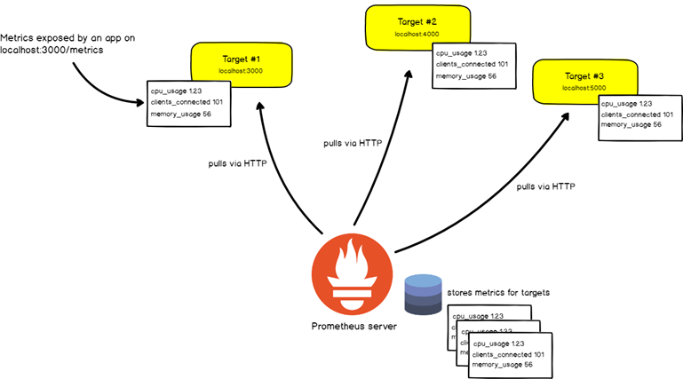

# Prometheus

> 本章主要介绍如何对XXX进行一个快速的简单上手使用，适用于xxxx使用。


## Author

```
Name: Shinefire
Blog: https://github.com/shine-fire/Ops_Notes
E-mail: shine_fire@outlook.com
```


## Introduction

### 什么是prometheus？

官方原话：

[Prometheus](https://github.com/prometheus) is an open-source systems monitoring and alerting toolkit originally built at [SoundCloud](https://soundcloud.com/). Since its inception in 2012, many companies and organizations have adopted Prometheus, and the project has a very active developer and user [community](https://prometheus.io/community). It is now a standalone open source project and maintained independently of any company. To emphasize this, and to clarify the project's governance structure, Prometheus joined the [Cloud Native Computing Foundation](https://cncf.io/) in 2016 as the second hosted project, after [Kubernetes](https://kubernetes.io/).

Prometheus collects and stores its metrics as time series data, i.e. metrics information is stored with the timestamp at which it was recorded, alongside optional key-value pairs called labels.

For more elaborate overviews of Prometheus, see the resources linked from the [media](https://prometheus.io/docs/introduction/media/) section.


Others：

Prometheus是一款时序（time series）数据库；但它的功能却并非止步于TSDB，而是一款设计用于进行目标（Target）监控的关键组件

结合生态系统内的其它组件，例如Pushgateway、Altermanager和Grafana等，可构成一个完整的IT监控系统。

时序数据，是在一段时间内通过重复测量（measurement）而获得的观测值的集合，将这些观测值绘制于图形之上，它会有一个数据轴和一个时间轴。服务器指标数据、应用程序、性能监控数据、网络数据等也都是时序数据


### 传统的监控系统模型

传统的监控系统模型，例如Nagios，Zabbix等，都是需要安装一个Agent在被监控设备中。


### Prometheus的优势

Prometheus是一个开源的完整监控解决方案，其对传统监控系统的测试和告警模型进行了彻底的颠覆，形成了基于中央化的规则计算、统一分析和告警的新模型。 相比于传统监控系统Prometheus具有以下优点：


#### 易于管理

Prometheus核心部分只有一个单独的二进制文件，不存在任何的第三方依赖(数据库，缓存等等)。**唯一需要的就是本地磁盘**，因此不会有潜在级联故障的风险。

Prometheus基于Pull模型的架构方式，可以在任何地方（本地电脑，开发环境，测试环境）搭建我们的监控系统。对于一些复杂的情况，还可以使用Prometheus服务发现(Service Discovery)的能力动态管理监控目标。


#### 监控服务的内部运行状态

Pometheus鼓励用户监控服务的内部状态（这个应该就是所谓的白盒监控吧），基于Prometheus丰富的Client库，用户可以轻松的在应用程序中添加对Prometheus的支持，从而让用户可以获取服务和应用内部真正的运行状态。


#### 强大的数据模型

所有采集的监控数据均以指标(metric)的形式保存在内置的时间序列数据库当中(TSDB)。所有的样本除了基本的指标名称以外，还包含一组用于描述该样本特征的标签。

如下所示：

```
http_request_status{code='200',content_path='/api/path', environment='produment'} => [value1@timestamp1,value2@timestamp2...]

http_request_status{code='200',content_path='/api/path2', environment='produment'} => [value1@timestamp1,value2@timestamp2...]
```

每一条时间序列由指标名称(Metrics Name)以及一组标签(Labels)唯一标识。每条时间序列按照时间的先后顺序存储一系列的样本值。

表示维度的标签可能来源于你的监控对象的状态，比如code=404或者content_path=/api/path。也可能来源于的你的环境定义，比如environment=produment。基于这些Labels我们可以方便地对监控数据进行聚合，过滤，裁剪。


#### 强大的查询语言PromQL

Prometheus内置了一个强大的数据查询语言PromQL。 通过PromQL可以实现对监控数据的查询、聚合。同时PromQL也被应用于数据可视化(如Grafana)以及告警当中。

通过PromQL可以轻松回答类似于以下问题：

- 在过去一段时间中95%应用延迟时间的分布范围？
- 预测在4小时后，磁盘空间占用大致会是什么情况？
- CPU占用率前5位的服务有哪些？(过滤)


#### 高效

对于监控系统而言，大量的监控任务必然导致有大量的数据产生。而Prometheus可以高效地处理这些数据，对于单一Prometheus Server实例而言它可以处理：

- 数以百万的监控指标
- 每秒处理数十万的数据点。


#### 可扩展

Prometheus是如此简单，因此你可以在每个数据中心、每个团队运行独立的Prometheus Sevrer。Prometheus对于联邦集群的支持，可以让多个Prometheus实例产生一个逻辑集群，当单实例Prometheus Server处理的任务量过大时，通过使用功能分区(sharding)+联邦集群(federation)可以对其进行扩展。


#### 易于集成

使用Prometheus可以快速搭建监控服务，并且可以非常方便地在应用程序中进行集成。目前支持： Java， JMX， Python， Go，Ruby， .Net， Node.js等等语言的客户端SDK，基于这些SDK可以快速让应用程序纳入到Prometheus的监控当中，或者开发自己的监控数据收集程序。同时这些客户端收集的监控数据，不仅仅支持Prometheus，还能支持Graphite这些其他的监控工具。

同时Prometheus还支持与其他的监控系统进行集成：Graphite， Statsd， Collected， Scollector， muini， Nagios等。

Prometheus社区还提供了大量第三方实现的监控数据采集支持：JMX， CloudWatch， EC2， MySQL， PostgresSQL， Haskell， Bash， SNMP， Consul， Haproxy， Mesos， Bind， CouchDB， Django， Memcached， RabbitMQ， Redis， RethinkDB， Rsyslog等等。


#### 可视化

Prometheus Server中自带了一个Prometheus UI，通过这个UI可以方便地直接对数据进行查询，并且支持直接以图形化的形式展示数据。同时Prometheus还提供了一个独立的基于Ruby On Rails的Dashboard解决方案Promdash。最新的Grafana可视化工具也已经提供了完整的Prometheus支持，基于Grafana可以创建更加精美的监控图标。基于Prometheus提供的API还可以实现自己的监控可视化UI。


#### 开放性

通常来说当我们需要监控一个应用程序时，一般需要该应用程序提供对相应监控系统协议的支持。因此应用程序会与所选择的监控系统进行绑定。为了减少这种绑定所带来的限制。对于决策者而言要么你就直接在应用中集成该监控系统的支持，要么就在外部创建单独的服务来适配不同的监控系统。

而对于Prometheus来说，使用Prometheus的client library的输出格式不止支持Prometheus的格式化数据，也可以输出支持其它监控系统的格式化数据，比如Graphite。

因此你甚至可以在不使用Prometheus的情况下，采用Prometheus的client library来让你的应用程序支持监控数据采集。


### Prometheus的数据采集工作原理

在Prometheus采集数据的方式是基于http的pull方式

被采集数据的服务器，其实类似于server端，通过将自己的数据暴露出来，让作为client端的Prometheus则通过http pull的形式访问获取需要的数据

如下图：




Prometheus支持三种类型的途径从目标上抓取（Scrape）指标数据：

- Exporters
- Instrumentation
- Pushgateway，我觉得这个设计真的挺棒的，适用于一些短期任务数据生产者之类，不知道什么时候临时生产一些数据也不好暴露展示了，就直接自己先push到这个pushgateway中间商，Prometheus自己看自己的安排去这个中间商这里pull指标数据就完事了。

图示：


### Prometheus的生态组件

Prometheus本身在狭义上来说主要是一个TSDB，负责时序型指标数据的采集及存储，承担起整个企业级监控系统的重任时，还需要其他一些生态组件的配合使用才行。

例如数据的分析、聚合及直观展示以及告警等功能并非由Prometheus Server所负责，而是需要结合其他的组件一起来实现这些功能。

简单的生态组件架构如下图：


各组件说明：

- **Prometheus Server**: 收集和存储时间序列数据
- **Client Library**: 客户端库，目的在于为那些期望原生提供Instrumentation功能的应用程序提供便捷的开发途径
- **Push Gateway**: 接收那些通常由短期作业生成的指标数据的网关，并支持由PrometheusServer进行指标拉取操作
- **Exporters**: 用于暴露现有应用程序或服务（不支持Instrumentation）的指标给Prometheus Server
- **Alertmanager**: 从Prometheus Server接收到“告警通知”后，通过去重、分组、路由等预处理功能后以高效向用户完成告警信息发送
- **Data** **Visualization**：Prometheus Web UI （Prometheus Server内建），及Grafana等
- **Service** **Discovery**：动态发现待监控的Target，从而完成监控配置的重要组件，在容器化环境中尤为有用；该组件目前由Prometheus Server内建支持


### Prometheus数据模型（待补充）


### Prometheus指标类型（待补充）


#### Prometheus架构

架构图：


## References

- [Prometheus Docs](https://prometheus.io/docs/introduction/overview/)
- [prometheus-book](https://yunlzheng.gitbook.io/prometheus-book/)
- 

