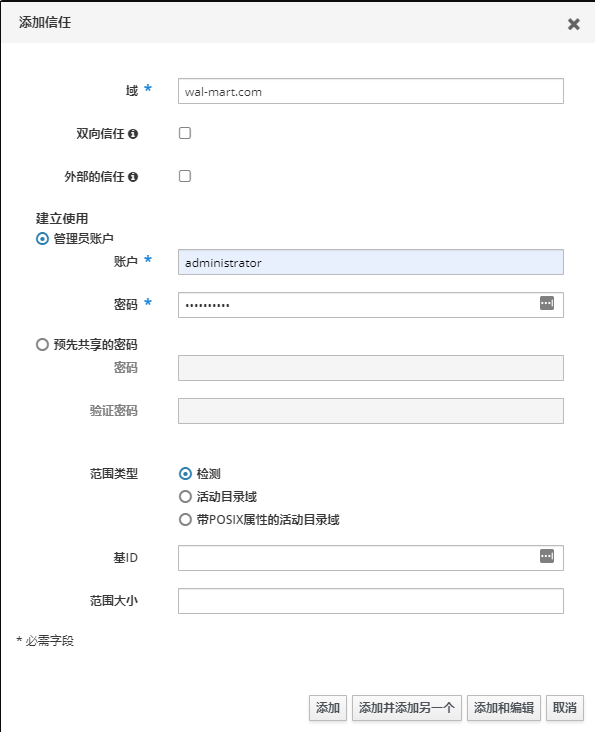

# IdM与AD建立trust测试

[TOC]


## 测试环境说明

### 测试环境架构图


### 测试环境架构说明

| Role             | Hostname/domain             | IPADDR         | OS Version         |
| ---------------- | --------------------------- | -------------- | ------------------ |
| AD parent DNS    | dns1.wal-mart.com           | 192.168.31.121 | win server 2012 r2 |
| AD parent server | ad-parent.wal-mart.com      | 192.168.31.123 | win server 2012 r2 |
| AD child server  | ad-child.cn.wal-mart.com    | 192.168.31.124 | win server 2012 r2 |
| Win PC1          | winpc1.wal-mart.com         | 192.168.31.125 | win server 2012 r2 |
| Win PC2          | winpc2.cn.wal-mart.com      | 192.168.31.126 | win server 2012 r2 |
| IdM Server       | server.idm.cn.wal-mart.com  | 192.168.31.130 | CentOS7.8          |
| IdM Client1      | client1.idm.cn.wal-mart.com | 192.168.31.131 | CentOS7.8          |
| IdM Client2      | client2.cn.wal-mart.com     | 192.168.31.132 |                    |
| IDM Client3      | client3.cn.wal-mart.com     | 192.168.31.133 |                    |


windows server 2012 r2 激活密钥：78NJB-CB3WX-GWPCM-VMKG7-94QWW


## AD环境部署

### AD域DNS部署

分别在两个主控服务器中部署DNS服务器，分别用于两个域的域名解析，部署过程：略

### AD域主控

分别在两个域中建立AD域域控服务器，部署过程：略

### AD域子域创建

参考：https://www.webfalse.com/read/206307/4122233.html

### 查看父子域创建结果

创建好两个域的trust后，结果如下图所示：


## IdM Server部署

### 环境准备

#### YUM源配置

```bash
# wget http://192.168.31.100/repos/centos7/base.repo -P /etc/yum.repos.d/
```

### 安装软件包

安装相关软件包

```bash
# yum install ipa-server -y
```

### 启动安装程序进行安装

运行安装程序来进行交互式安装

```bash
# ipa-server-install --mkhomedir
```

非交互式安装

```bash
# ipa-server-install --mkhomedir --hostname server.idm.cn.wal-mart.com --domain idm.cn.wal-mart.com --realm IDM.CN.WAL-MART.COM --ds-password Redhat2020 --admin-password Redhat2020 --unattended 
```

### 添加DNS记录

```bash
# cat /tmp/ipa.system.records.q04dE2.db
_kerberos-master._tcp.idm.cn.wal-mart.com. 86400 IN SRV 0 100 88 server.idm.cn.wal-mart.com.
_kerberos-master._udp.idm.cn.wal-mart.com. 86400 IN SRV 0 100 88 server.idm.cn.wal-mart.com.
_kerberos._tcp.idm.cn.wal-mart.com. 86400 IN SRV 0 100 88 server.idm.cn.wal-mart.com.
_kerberos._udp.idm.cn.wal-mart.com. 86400 IN SRV 0 100 88 server.idm.cn.wal-mart.com.
_kerberos.idm.cn.wal-mart.com. 86400 IN TXT "IDM.CN.WAL-MART.COM"
_kpasswd._tcp.idm.cn.wal-mart.com. 86400 IN SRV 0 100 464 server.idm.cn.wal-mart.com.
_kpasswd._udp.idm.cn.wal-mart.com. 86400 IN SRV 0 100 464 server.idm.cn.wal-mart.com.
_ldap._tcp.idm.cn.wal-mart.com. 86400 IN SRV 0 100 389 server.idm.cn.wal-mart.com.
_ntp._udp.idm.cn.wal-mart.com. 86400 IN SRV 0 100 123 server.idm.cn.wal-mart.com.
ipa-ca.idm.cn.wal-mart.com. 86400 IN A 192.168.31.130
```

## IdM Client部署

### 安装相关软件包

```bash
# yum install ipa-client -y 
```

### 交互式安装

```bash
# ipa-client-install --mkhomedir
...
Discovery was successful!
Client hostname: client1.idm.com
Realm: IDM.COM
DNS Domain: idm.com
IPA Server: server.idm.com
BaseDN: dc=idm,dc=com
...
User authorized to enroll computers: admin
Password for admin@IDM.COM:
...
```

如果自动发现的结果不是预期的或者是无法正常自动发现，那么可以在执行命令时通过加参数来指定

### 非交互式安装

#### 在server端运行下面的命令先生成一个随机密码

```
# ipa host-add client1.cn.wal-mart.com --random
------------------------------------
Added host "client1.cn.wal-mart.com"
------------------------------------
  Host name: client1.cn.wal-mart.com
  Random password: 6GtWb5Ymtk4i5Cr3BPg6BEk
  Password: True
  Keytab: False
  Managed by: client1.cn.wal-mart.com
```

#### 在client端运行安装程序(待修改)

```
# ipa-client-install --password '4MtWHnOUWP2hLi77RkfL3We' --hostname client1.idm.cn.wal-mart.com --server server.idm.cn.wal-mart.com --domain idm.cn.wal-mart.com --realm IDM.CN.WAL-MART.COM --mkhomedir --unattended 
```

## IdM用户管理

### 用户家目录自动挂载

在使用IdM中创建的用户去登录client端时，是可以自动挂载家目录的，但是前提是需要配置好自动挂载。

参考：https://access.redhat.com/documentation/en-us/red_hat_enterprise_linux/7/html-single/linux_domain_identity_authentication_and_policy_guide/index#home-directories

## 建立Trust

### 安装软件包

```bash
# yum install ipa-server ipa-server-trust-ad samba-client -y
```

### 安装trust

```bash
# ipa-adtrust-install
```

### 启动Samba服务

```bash
# systemctl enable smb --now
# systemctl status smb
```

### 建立trust

```bash
# ipa trust-add --type=ad wal-mart.com --admin super --password
```

### 默认已建立trust，无法再次建立

### trust验证

验证的方法参考[5.2.2.1.3 Verifying the Kerberos Configuration](https://access.redhat.com/documentation/en-us/red_hat_enterprise_linux/7/html-single/windows_integration_guide/index#create-a-trust)

1. Request a ticket for an IdM user:

   ```bash
   [root@server ~]# kinit super@wal-mart.com
   Password for super@wal-mart.com:
   ```

2. Request service tickets for a service within the IdM domain:

   ```bash
   [root@server ~]# kvno -S host server.ipa.cn.wal-mart.com
   host/server.ipa.cn.wal-mart.com@IPA.CN.WAL-MART.COM: kvno = 2
   ```

3. If the AD service ticket is successfully granted, there is a cross-realm ticket-granting ticket (TGT) listed with all of the other requested tickets. The TGT is named `krbtgt/IPA.DOMAIN@AD.DOMAIN`.

   ```bash
   [root@server ~]# klist
   Ticket cache: KEYRING:persistent:0:krb_ccache_jXEGuS4
   Default principal: super@WAL-MART.COM
   
   Valid starting       Expires              Service principal
   07/30/2020 15:23:46  07/31/2020 01:20:54  cifs/ad-parent.wal-mart.com@WAL-MART.COM
           renew until 07/31/2020 15:20:50
   07/30/2020 15:23:46  07/31/2020 01:20:54  cifs/ad-parent.wal-mart.com@
           renew until 07/31/2020 15:20:50
   07/30/2020 15:23:28  07/31/2020 01:20:54  host/server.ipa.cn.wal-mart.com@IPA.CN.WAL-MART.COM
           renew until 07/31/2020 15:20:50
   07/30/2020 15:21:15  07/31/2020 01:20:54  krbtgt/IPA.CN.WAL-MART.COM@WAL-MART.COM
           renew until 07/31/2020 15:20:50
   07/30/2020 15:20:54  07/31/2020 01:20:54  krbtgt/WAL-MART.COM@WAL-MART.COM
           renew until 07/31/2020 15:20:50
   ```

   example：*krbtgt/IPA.CN.WAL-MART.COM@WAL-MART.COM*

4. 


## AD域用户登录测试

将AD域用户加入到IdM外部组再添加从属于一个内部组以后，便可以使用AD域用户ssh远程登录idm client。

ssh登录操作如下：

```bash
# ssh super@wal-mart.com@client1.idm.cn.wal-mart.com
Password:
Last login: Sun Aug  9 03:58:13 2020 from server.idm.com
```

系统中切换到AD域用户：

```bash
$ su - test1@wal-mart.com
Password:
Last login: Sun Aug  9 11:52:49 CST 2020 from server.idm.com on pts/1
Last failed login: Sun Aug  9 11:53:58 CST 2020 on pts/1
There was 1 failed login attempt since the last successful login.
-sh-4.2$
```

## 踩坑总结

### 已建立trust

因为cn.wal-mart.com本来就已经是根域wal-mart.com的一个子域了，所以本来就已经建立了trust了，那我现在似乎就没办法继续再建立trust了...


但是查看已建立trust的话，又无法看到相关的trust domain，所以这也很尴尬...

再到图形界面查看一下，图形界面的信任栏下，如果正常情况是能够看到已建立trust的domain的，但是目前也是处于空的状态


尝试在图形界面再做一遍trust，如下操作添加trust



但是最后的提示也依旧还是一样的问题，已存在了，无法再建立：


无法建立trust的话，后续的fetch和find也一样是会失败的

执行命令trust-fetch-domains：

```bash
# ipa trust-fetch-domains wal-mart.com
ipa: ERROR: wal-mart.com: trust not found
```

执行命令trustdomain-find：

```bash
# ipa trustdomain-find
Realm name: wal-mart.com
ipa: ERROR: wal-mart.com: trust not found
```

这种情况下，AD域的用户也无法登陆IPA的WEB界面。

### 建立trust权限不够

AD域中的用户如果使用的是非enterprise admin组的用户成员，则会因为权限不够，无法与指定的域建立trust。

必须要将该用户加入到enterprise admin组中才可以继续

加入enterprise admin组之前，因为权限不够失败：


加入enterprise admin组之后，建立trust成功：


### 已建立trust的情况下无法添加AD域用户

因为idm所在的域已经是AD域的一个子域了，所以无法再次创建trust，这种情况下，在IdM的角度上看，就是和没有创建trust一样，无法继续后面的操作，包括添加AD域用户。

正常建立了trust后，能够添加AD域的用户：


而已经建立了trust，无法再创建的情况下，是无法找到AD域中的用户的：

