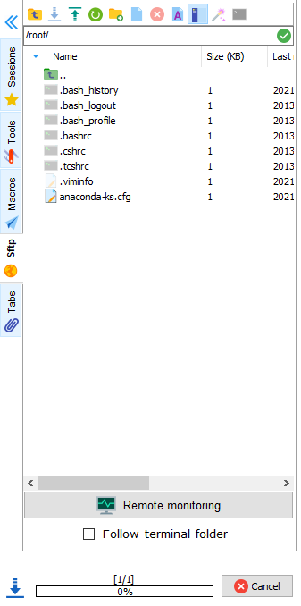

# SSH与SFTP分离方案

> 本章主要介绍如何将sftp从ssh中分离出来，避免和ssh一样使用22端口来进行数据传输
>
> 此文档为基于RHEL7版本中的测试


## Author

```
Name: Shinefire
Blog: https://github.com/shine-fire/Ops_Notes
E-mail: shine_fire@outlook.com
```


## Introduction

### sftp介绍

SFTP：SSH File Transfer Protocol ，有时也被称作 Secure File Transfer Protocol 。

SFTP是用SSH封装过的FTP协议，相当于经过加密的FTP协议，功能与FTP一样，只是传输数据经过加密。

SFTP也有二个部分，服务端的SFTP-Server及SFTP Client。通常所说的用SFTP登录到某台主机，指的是用SFTP客户端登录到某台主机（该主机运行了SFTP-Server服务端程序）。

SFTP为SSH的一部分，在SSH（RedHat Linux中为OPENSSH）软件包中，已经包含了一个叫作SFTP（Secure File Transfer Protocol）的安全文件传输子系统，**SFTP本身没有单独的守护进程，它必须使用sshd守护进程（端口号默认是22）来完成相应的连接操作**。正常情况下，安装完操作系统后，默认已经安装SSH服务。


### 为什么需要sftp分离？

在一些安全需求下，需要将sftp分离出来使用，更有利于权限的管理与风险把控。

可以实现单独进行用户控制：限制某些用户只能使用sftp传输，无法ssh登陆，某些用户只能ssh登陆，无法进行sftp传输。


## SFTP分离方案

### SFTP服务分离配置

修改`sshd_config`默认配置文件注释掉 `Subsystem sftp` 行，这样相当于把sshd服务默认启用的sftp服务关闭了。

```bash
[root@rhel76-ori ssh]# grep sftp /etc/ssh/sshd_config
# Subsystem     sftp    /usr/libexec/openssh/sftp-server
```


另外如果之前有在配置文件开启 Match 选项相关的行，也一并全部注释，例如：

```
#Match User anoncvs
#   X11Forwarding no
#   AllowTcpForwarding no
#   PermitTTY no
#   ForceCommand cvs server
```


例如关闭sftp子系统后测试使用sftp传输文件已经是会卡住不动了




拷贝`sshd_config`生成`sftpd_config`配置文件并修改内容

```bash
[root@rhel76-ori ~]# cp /etc/ssh/sshd_config /etc/ssh/sftpd_config
[root@rhel76-ori ~]# vim /etc/ssh/sftpd_config
Port 8022
PidFile /var/run/sftpd.pid
Subsystem sftp internal-sftp
# Match User sftpuser
```


创建sftpd的执行程序链接

```bash
[root@rhel76-ori ~]# ln -s /usr/sbin/sshd /usr/sbin/sftpd
```


拷贝创建`/etc/sysconfig/sftpd`配置文件

```bash
[root@rhel76-ori ~]# cp /etc/sysconfig/sshd  /etc/sysconfig/sftp
```


配置sftp PAM认证

```bash
[root@rhel76-ori ~]# cp /etc/pam.d/sshd /etc/pam.d/sftpd
```


拷贝修改sftpd.service配置文件

```bash
[root@rhel76-ori ~]# cp /usr/lib/systemd/system/sshd.service  /etc/systemd/system/sftpd.service
[root@rhel76-ori ~]# vim /etc/systemd/system/sftpd.service
[Unit]
Description=sftp server daemon						# 需要修改
Documentation=man:sshd(8) man:sshd_config(5)
After=network.target sshd-keygen.service
Wants=sshd-keygen.service

[Service]
Type=notify
PIDFile=/var/run/sftpd.pid							# 需要修改
EnvironmentFile=/etc/sysconfig/sftp					# 需要修改
ExecStart=/usr/sbin/sftpd -f /etc/ssh/sftpd_config	# 需要修改
ExecReload=/bin/kill -HUP $MAINPID
KillMode=process
Restart=on-failure
RestartSec=42s

[Install]
WantedBy=multi-user.target
```


启动sftp服务

```bash
[root@rhel76-ori ~]# systemctl daemon-reload
[root@rhel76-ori ~]# systemctl start sftpd.service
```


检查端口监听状态

```bash
[root@rhel76-ori ~]# netstat -nltup
Active Internet connections (only servers)
Proto Recv-Q Send-Q Local Address           Foreign Address         State       PID/Program name
tcp        0      0 0.0.0.0:8022            0.0.0.0:*               LISTEN      47769/sftpd
tcp        0      0 0.0.0.0:22              0.0.0.0:*               LISTEN      7510/sshd
tcp        0      0 127.0.0.1:25            0.0.0.0:*               LISTEN      7828/master
tcp6       0      0 :::8022                 :::*                    LISTEN      47769/sftpd
tcp6       0      0 :::22                   :::*                    LISTEN      7510/sshd
tcp6       0      0 ::1:25                  :::*                    LISTEN      7828/master
```


登录测试

```bash
[root@rhel76-ori ~]# sftp -P 8022 root@localhost
The authenticity of host '[localhost]:8022 ([::1]:8022)' can't be established.
ECDSA key fingerprint is SHA256:N/xQvi1Y/JsEYVfVwf2mC49yRk59Z/O80JW4GZX3qAw.
ECDSA key fingerprint is MD5:25:16:77:18:d7:71:d4:d5:e2:60:3a:e5:2c:17:52:3b.
Are you sure you want to continue connecting (yes/no)? yes
Warning: Permanently added '[localhost]:8022' (ECDSA) to the list of known hosts.
root@localhost's password:
Connected to localhost.
sftp>
```


### SFTP用户配置

上面的基本分离方案，用的是直接使用root用户来登录sftp的，但是在实际使用中，基本上是另外使用专门的用户来进行sftp传输数据的。

创建一个sftp专用的group

```bash
~]# groupadd sftpgrp
```


创建一个sftp专用用户

```bash
~]# useradd apt -s /sbin/nologin -G sftpgrp
~]# id apt
uid=1000(apt) gid=1000(apt) groups=1000(apt),1001(sftpgrp)
~]# passwd apt
```

说明：登录的shell设置为 nologin 则可以让用户无法进行 ssh 登录


修改 /etc/ssh/sftpd_config，添加下面的行

```
Match Group sftpgrp
    ForceCommand internal-sftp
    AllowTcpForwarding no
    X11Forwarding no
    #ChrootDirectory /sftp/%u
```

参数说明：ChrootDirectory 如果没有特别需求可以注释掉，如果想创建一个专用于sftp传输的目录，可以这样设置后再设置好目录权限


重启服务

```bash
[root@rhel76-ori ssh]# systemctl restart sftpd.service
[root@rhel76-ori ssh]# systemctl status sftpd.service
● sftpd.service - sftp server daemon
   Loaded: loaded (/etc/systemd/system/sftpd.service; disabled; vendor preset: disabled)
   Active: active (running) since Wed 2021-11-10 10:22:25 CST; 7s ago
     Docs: man:sshd(8)
           man:sshd_config(5)
 Main PID: 32774 (sftpd)
   CGroup: /system.slice/sftpd.service
           └─32774 /usr/sbin/sftpd -f /etc/ssh/sftpd_config

Nov 10 10:22:25 rhel76-ori.shinefire.com systemd[1]: Starting sftp server daemon...
Nov 10 10:22:25 rhel76-ori.shinefire.com sftpd[32774]: Server listening on 0.0.0.0 port 8022.
Nov 10 10:22:25 rhel76-ori.shinefire.com sftpd[32774]: Server listening on :: port 8022.
Nov 10 10:22:25 rhel76-ori.shinefire.com systemd[1]: Started sftp server daemon.
```


另外登录一台机器进行sftp登录测试

```bash
[root@nuc ~]# sftp -P 8022 apt@192.168.31.196
apt@192.168.31.196's password:
Connected to 192.168.31.196.
sftp>
```


### SFTP数据目录


### SFTP日志配置


### SFTP用户黑白名单配置


### SFTP主机中的用户黑白名单配置


### SFTP主机黑白名单配置


## Troubleshooting

Q1：

在修改了 systemd 配置文件后，启动服务遇到报错：

```.
-- Unit sftpd.service has begun starting up.
Nov 09 21:59:54 rhel76-ori.shinefire.com sftpd[10021]: error: Bind to port 8022 on 0.0.0.0 failed: Permission denied.
Nov 09 21:59:54 rhel76-ori.shinefire.com sftpd[10021]: error: Bind to port 8022 on :: failed: Permission denied.
Nov 09 21:59:54 rhel76-ori.shinefire.com sftpd[10021]: fatal: Cannot bind any address.
Nov 09 21:59:54 rhel76-ori.shinefire.com systemd[1]: sftpd.service: main process exited, code=exited, status=255/n/a
Nov 09 21:59:54 rhel76-ori.shinefire.com systemd[1]: Failed to start sftp server daemon.
-- Subject: Unit sftpd.service has failed
-- Defined-By: systemd
-- Support: http://lists.freedesktop.org/mailman/listinfo/systemd-devel
--
-- Unit sftpd.service has failed.
```

A1：

这个是因为开启了 SELinux 所导致的，解决办法可以直接关掉 SELinux

参考：https://blog.csdn.net/default7/article/details/103592139


## References

- [说说SSH、SCP和SFTP的那些事儿](https://cloud.tencent.com/developer/article/1042350)
- [CentOS修改Ssh端口提示error: Bind to port 2271 on 0.0.0.0 failed: Permission denied.](https://blog.csdn.net/default7/article/details/103592139)

