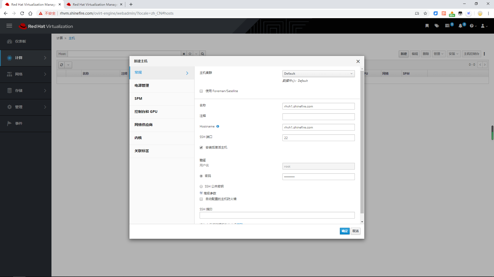

# Install RHV

> 这是一个部署与使用RHV的文档，以我的自己的测试环境为例，做了一个使用RHV的测试环境。

## Author

```
Name:Shinefire
Blog:https://github.com/shine-fire/Ops_Notes
E-mail:shine_fire@qq.com
```

## 一、原理介绍

## 二、基于普通RHEL7的标准安装步骤

### 2.1 环境需求与说明

- 部署的RHV版本为4.3的repo源
- 使用普通RHEL7替代RHV-H
- iSCSI共享存储
- DNS正反向解析

| IP             | HOSTNAME            | 作用        |
| -------------- | ------------------- | ----------- |
| 192.168.31.100 | nuc.shinefire.com   | yum源       |
| 192.168.31.101 | rhvm.shinefire.com  | rhv manager |
| 192.168.31.102 | iscsi.shinefire.com | iSCSI，NFS  |
| 192.168.31.103 | rhvh1.shinefire.com | rhv host1   |
| 192.168.31.104 | rhvh2.shinefire.com | rhv host2   |

[防火墙的开放要求参考表格](https://access.redhat.com/documentation/en-us/red_hat_virtualization/4.3/html/installing_red_hat_virtualization_as_a_standalone_manager_with_local_databases/rhv_requirements#host-firewall-requirements_SM_localDB_deploy)

### 2.2 RHVM配置yum源

可以使用订阅的方式或者自建yum源都行，我的测试环境是使用的自建内网yum源的方式（也需要订阅后将repo同步至本地），下面讲一下如何使用红帽的订阅。

1. 订阅

   ```bash
   # subscription-manager register
   ```

2. Find the `Red Hat Enterprise Linux Server` and `Red Hat Virtualization` subscription pools and record the pool IDs: 

   ```bash
   # subscription-manager list --available
   ```

3. Attach pool ID

   ```bash
   # subscription-manager attach --pool=xxxx
   ```

4.  Configure the repositories

   ```bash
   # subscription-manager repos \
       --disable='*' \
       --enable=rhel-7-server-rpms \
       --enable=rhel-7-server-supplementary-rpms \
       --enable=rhel-7-server-rhv-4.3-manager-rpms \
       --enable=rhel-7-server-rhv-4-manager-tools-rpms \
       --enable=rhel-7-server-ansible-2-rpms \
       --enable=jb-eap-7.2-for-rhel-7-server-rpms
   ```

### 2.3 Install Red Hat Virtualization Manager

1. Ensure all packages are up to date:

   ```bash
   # yum update
   ```

2. Install the package and dependencies. 

   ```bash
   # yum install rhvm rhv-guest-tools-iso* virtio-win virt-viewer 
   ```

   rhvm是manager的核心（必需）

   rhv-guest-tools-iso* 部署虚拟机需要使用到的工具（必需）

   virtio-win部署windows虚拟机需要使用的工具（必需）

   virt-viewer是用来可能需要到的客户端查看工具（可选）

3. Run the `engine-setup` command to begin configuring the Red Hat Virtualization Manager: 

   防火墙我这里是直接关闭的，所以不按默认的配置来，其他的全部按默认配置`Enter`确认即可。

4. 登录web端查看 https://rhvm.shinefire.com/ovirt-engine/ 

5. 点击**Administration Portal/管理门户**进行登录

6. 默认账户admin，密码为安装的时候所设置的密码。

### 2.4 Install Host

1. 配置yum源

2. 更新

   ```bash
   [root@rhvh1 ~]# yum update -y
   ```

3. 更新了kernel重启机器

4. 安装dashboard

   ```bash
   # yum install cockpit-ovirt-dashboard
   # systemctl enable cockpit.socket
   # systemctl start cockpit.socket
   # firewall-cmd --list-services
   # firewall-cmd --permanent --add-service=cockpit
   ```

   cockpit.socket会使用到9000端口，如果和其他需要使用的软件有端口冲突的话，可以通过修改文件里面指定其他的端口来实现。

5. 暂无

### 2.5 将HOSTS添加到manager中

1. 确保HOSTS机器开启了虚拟化

2. 登录manager的web端

   输入url，点击administrator portal进入

3. 添加hosts

   Compute --> Hosts --> New

   

4. 暂无

### 对接iSCSI

1. Click Storage → Domains.
2. Click **New Domain**.
3. Enter the **Name** of the new storage domain.
4. Select a **Data Center** from the drop-down list.
5. Select **Data** as the **Domain Function** and **iSCSI** as the **Storage Type**.
6. Select an active host as the **Host**.
7. discover(no select User Auth...)
8. select User Authenticantion and Login All
9. ADD and OK

### 对接NFS上传ISO

1. Click Storage → Domains.
2. Click **New Domain**.

注意的点：ISO传到/usr/share/iso这个目录下最好；属主记得给36；dns解析别搞错

还要将ISO传到之后nfs目录下自动生成的目录中去。

### 创建虚拟机

修改Custom Emulated Machine

```bash
Changing the "Custom Emulated Machine" from "pc-i440fx-rhel7.3.0" to "pc-i440fx-rhel7.2.0" resolved the issue for me. -
```

### 创建windows虚拟机

安装软件包

```bash
# yum -y install virtio-win rhv-guest-tools-iso*
```

上传文件到ISO镜像域

```bash
# yum -y install virtio-win rhv-guest-tools-iso*
# engine-iso-uploader --iso-domain=rhvh2-iso upload  \
    /usr/share/virtio-win/virtio-win_amd64.vfd \
    /usr/share/virtio-win/virtio-win_servers_amd64.vfd \
    /usr/share/virtio-win/virtio-win_servers_x86.vfd \
    /usr/share/virtio-win/virtio-win_x86.vfd \
    /usr/share/virtio-win/virtio-win.iso \
    /usr/share/rhv-guest-tools-iso/RHV-toolsSetup_version.iso
```

### guest安装agent

```bash
# engine-iso-uploader --iso-domain=rhvh2-iso upload /usr/share/rhv-guest-tools-iso/rhv-tools-setup.iso
```

## 附录
### 附录1 配置iSCSI服务端

### 附录2 配置NFS服务端

## 参考文档

- [Product Guide](https://access.redhat.com/documentation/en-us/red_hat_virtualization/4.3/html/product_guide/index)
- [Red Hat Virtualization Terminology](https://access.redhat.com/documentation/en-us/red_hat_virtualization/4.3/html/product_guide/introduction#RHV_terminology)
- [Logical Networks](https://access.redhat.com/documentation/en-us/red_hat_virtualization/4.3/html/administration_guide/chap-logical_networks)
- [Installing Red Hat Virtualization as a standalone Manager with local databases](https://access.redhat.com/documentation/en-us/red_hat_virtualization/4.3/html/installing_red_hat_virtualization_as_a_standalone_manager_with_local_databases/index)
- [介绍administration web界面的使用](https://access.redhat.com/documentation/en-us/red_hat_virtualization/4.3/html/introduction_to_the_administration_portal/index)
- [Installing Red Hat Virtualization as a self-hosted engine using the Cockpit web interface](https://access.redhat.com/documentation/en-us/red_hat_virtualization/4.3/html/installing_red_hat_virtualization_as_a_self-hosted_engine_using_the_cockpit_web_interface/index)
- [Mixing local and remote databases](https://access.redhat.com/documentation/en-us/red_hat_virtualization/4.3/html/product_guide/installation#SM_install_options)
- [配置agent](https://access.redhat.com/documentation/en-us/red_hat_virtualization/4.3/html/virtual_machine_management_guide/installing_guest_agents_and_drivers_linux#Installing_the_Guest_Agents_and_Drivers_on_Red_Hat_Enterprise_Linux)