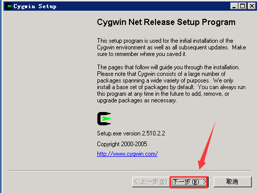
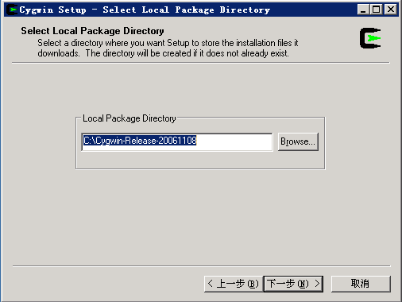
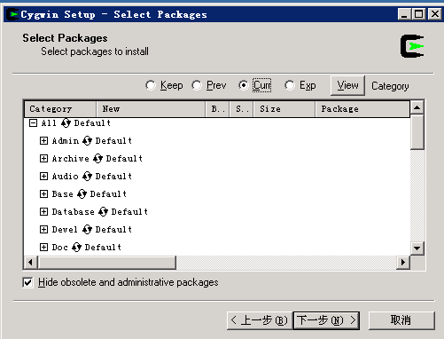

## 二、Windows Server 2003 R2

### 2.1 Windows Server 2003 R2 安装 Cygwin

由于windows server 2003R2比较久远，所以需要使用老版本Cygwin的setup才可以运行，如果直接在cygwin官网下载最新的就直接运行的话会提示版本不支持。所以找到一个老版本的镜像，可以直接离线进行安装使用。全部的安装使用过程如下：

1. 上传`Cygwin-Release-20061108.iso`到 Windows server 2003R2 中后解压

   

2. 进入解压后的目录，双击 `setup.exe` 运行程序

3. 点击下一步

   

4. 选择从本地目录安装

   

5. 默认选择好，点击下一步

   

6. 选择好之前解压好的文件夹路径，点击下一步

   

7. 进入到了选择需要安装包的界面

   

8. 勾选上以下这些包

   Devel > binutils：...  
   Devel > gcc-core：...  （会自动再勾选上gcc-mingw-core）  
   Devel > gcc-g++：...      (会自动再勾选上gcc-mingw-g++)  
   Devel > gdb：...  
   Net > openssh  （这个是重点，勾选上这个也会自动勾选上其他两个相关的）

9. 勾选好上面指定的包之后点击下一步

10. 静等安装好那些包后会弹出提示，点击完成

    

11. 提示安装完毕了

    

12. 将cygwin添加到系统环境变量中去

    `C:\cygwin\bin` 和 `C:\cygwin\usr\sbin` 这两个路径，操作方法（略）

13. 点击桌面的cygwin图标，启动成功

    

### 2.2 cygwin安装启动ssh

1. 启动cygwin之后，输入 ssh-host-config 进行ssh服务的配置

   配置过程中需要交互的五个地方按照下面这样回应即可。

   ```
   should privilege separation be used? <yes/no>   yes
   
   Should this script create a local user 'sshd' on this machine? <yes/no>  yes
   
   Do you want to install sshd as service?
   <Say "no" if it's already installed as service> <yes/no>  yes
   
   Should this script create a new local account 'sshd_server' which has the required privileges? <yes/no>  no
   
   Default is "ntsec". CYGWIN=ntsec
   ```

   

2. 启动sshd服务

   在配置完毕之后，可以使用 `net start sshd` 启动服务

   

3. 设置sshd服务开机自动启动

   进入 控制面板 >> 管理工具 >> 服务，将 `CYGWIN sshd` 服务设置为自动

   

4. 在Linux的服务器中使用ssh测试是否能够成功连接到windows server中

   

   根据测试看到是没有问题的。

### 2.3 Linux服务器使用ssh免密登录Windows Server 2003 R2

1. 在Linux服务器中生成密钥对

   使用`ssh-keygen`命令即可生成密钥对，后续全按回车即可

   ```bash
   [root@apt-2 ~]# ssh-keygen 
   Generating public/private rsa key pair.
   Enter file in which to save the key (/root/.ssh/id_rsa): 
   Enter passphrase (empty for no passphrase): 
   Enter same passphrase again: 
   Your identification has been saved in /root/.ssh/id_rsa.
   Your public key has been saved in /root/.ssh/id_rsa.pub.
   The key fingerprint is:
   SHA256:JjUKFuw1KBkTQA8fg4HRSx7kbhfL89XV5tPkOrn7NXE root@apt-2
   The key's randomart image is:
   +---[RSA 2048]----+
   |=OBB..           |
   |.oX.=.o      .   |
   | o.B+. .o   . o .|
   | .oo.+ o o . o + |
   |  o = o S .   o.E|
   | . . o +       +o|
   |      .       +..|
   |               oo|
   |              oo.|
   +----[SHA256]-----+
   ```

2. 将公钥拷到windows服务器中

   ```bash
   [root@apt-2 ~]# ssh-copy-id -i /root/.ssh/id_rsa.pub administrator@192.168.31.247
   /usr/bin/ssh-copy-id: INFO: Source of key(s) to be installed: "/root/.ssh/id_rsa.pub"
   /usr/bin/ssh-copy-id: INFO: attempting to log in with the new key(s), to filter out any that are already installed
   /usr/bin/ssh-copy-id: INFO: 1 key(s) remain to be installed -- if you are prompted now it is to install the new keys
   administrator@192.168.31.247's password: 
   
   Number of key(s) added: 1
   
   Now try logging into the machine, with:   "ssh 'administrator@192.168.31.247'"
   and check to make sure that only the key(s) you wanted were added.
   ```

3. ssh连接测试

   直接使用ssh进行连接，可以测试到能够实现免密登录

   ```bash
   [root@apt-2 ~]# ssh administrator@192.168.31.247
   Last login: Thu Jul  4 18:02:57 2019 from 192.168.31.121
   
   Administrator@shinefir-ce3347 ~
   $ 
   ```

### 2.4 Windows Server 2003 SP2 安装msi文件

- 开启 Windows Installer 服务

  控制面板 >> 管理工具 >> 服务  
  

- 运行安装

  在Linux server端通过ssh连接到windows服务器的cygwin中，再进行切换到cmd使用命令来进行静默安装

  ```sh
  [root@apt-2 ~]# ssh administrator@192.168.31.247
  Last login: Sun Jul  7 20:18:51 2019 from 192.168.31.121
  
  Administrator@shinefir-ce3347 ~
  $ cd /cygdrive/c/softs/
  
  Administrator@shinefir-ce3347 /cygdrive/c/softs
  $ cmd
  Microsoft Windows [ 5.2.3790]
  (C)  1985-2003 Microsoft Corp.
  c:\softs>msiexec /i 7z920-x64.msi /qb /l*v test.log
  msiexec /i 7z920-x64.msi /qb /l*v test.log
  ```

  说明：/i表示安装，test.msi是MSI安装包的全路径。**/qb表示安静安装（不需要用户点下一步）**，/l*v表示输出日志到 test.log文件。

- 查看结果

  安装完毕后可以到7-zip的默认软件安装目录下去查看结果

  ```bash
  c:\softs>exit
  exit
  Administrator@shinefir-ce3347 /cygdrive/c/softs
  $ cd ../Program\ Files/7-Zip/
  
  Administrator@shinefir-ce3347 /cygdrive/c/Program Files/7-Zip
  $ ls
  7-zip.chm  7z.exe     7zFM.exe     Lang          readme.txt
  7-zip.dll  7z.sfx     7zG.exe      License.txt
  7z.dll     7zCon.sfx  History.txt  descript.ion
  ```

- 卸载msi安装的程序

### 2.5 Windows Server 2003 SP2 安装exe文件

- 运行安装

  Linux服务端通过ssh连接到windows客户端中，进入到相应的目录，再用cmd命令打开cmd程序，直接进行静默安装。

  ```sh
  [root@apt-2 ~]# ssh administrator@192.168.31.247
  Last login: Mon Jul  8 11:05:47 2019 from 192.168.31.121
  
  Administrator@shinefir-ce3347 ~
  $ cd /cygdrive/c/softs/
  
  Administrator@shinefir-ce3347 /cygdrive/c/softs
  $ ls 
  7z920.exe           
  
  Administrator@shinefir-ce3347 /cygdrive/c/softs
  $ mkdir 7zip
  
  Administrator@shinefir-ce3347 /cygdrive/c/softs
  $ cmd 
  Microsoft Windows [ 5.2.3790]
  (C)  1985-2003 Microsoft Corp.
  
  c:\softs>7z1604-x64.exe /S /D=c:\softs\7zip
  7z1604-x64.exe /S /D=c:\softs\7zip
  ```

  *注意：某些exe安装包可能会需要使用不一样的参数来进行静默安装，具体可以参考一下：<https://www.cnblogs.com/toor/p/4198061.html>*

- 查看结果

  等待执行命令运行一段时间后再到指定的`c:\softs\7zip`查看可以看到已经安装成功

  ```sh
  c:\softs>exit
  exit
  
  Administrator@shinefir-ce3347 /cygdrive/c/softs
  $ ls 7zip/
  7-zip.chm    7z.dll  7zCon.sfx  History.txt  Uninstall.exe
  7-zip.dll    7z.exe  7zFM.exe   Lang         descript.ion
  7-zip32.dll  7z.sfx  7zG.exe    License.txt  readme.txt
  ```


## 